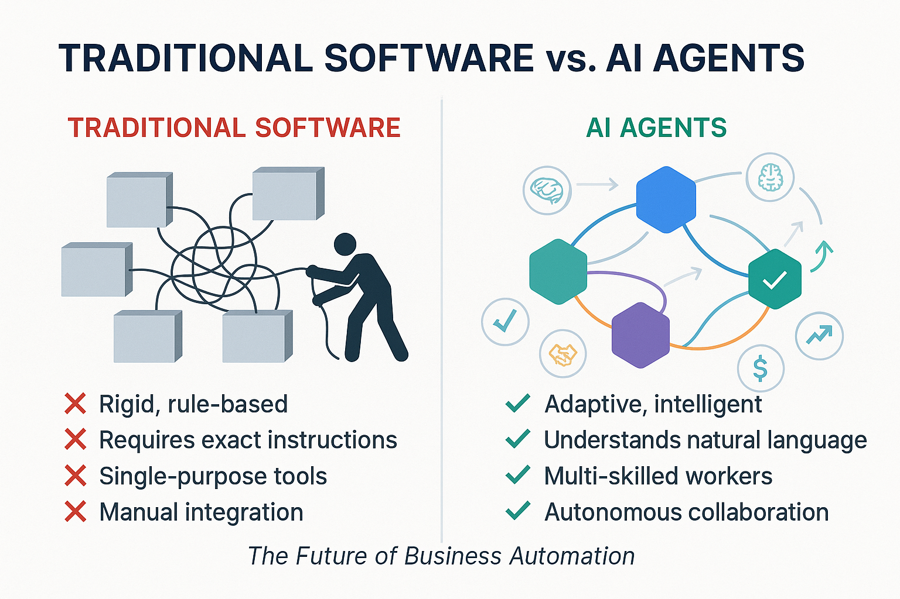

# AI Agents: The Future of Business Automation

## What Are AI Agents?

AI Agents are autonomous software programs that can:
- **Perceive** their environment through inputs
- **Reason** about problems using AI models
- **Act** by executing tasks and making decisions
- **Learn** from interactions and feedback

Think of them as **digital employees** that never sleep, never make mistakes, and can handle complex tasks at scale.

## Why Agents Matter for Business

### Traditional Software vs. AI Agents

| Traditional Software | AI Agents |
|---------------------|-----------|
| ❌ Rigid, rule-based | ✅ Adaptive, intelligent |
| ❌ Requires exact instructions | ✅ Understands natural language |
| ❌ Single-purpose tools | ✅ Multi-skilled workers |
| ❌ Manual integration | ✅ Autonomous collaboration |

### The Agent Advantage

1. **🧠 Intelligence**: Understands context and nuance
2. **🤝 Collaboration**: Agents work together seamlessly
3. **⚡ Speed**: Instant processing and decision-making
4. **📈 Scalability**: Handle unlimited concurrent tasks
5. **💰 Cost-Effective**: 24/7 operation without human overhead

## How Multi-Agent Systems Work

### The Orchestra Model
Just like a symphony orchestra, each agent has a specialized role:

- **🎼 Conductor Agent**: Orchestrates the overall workflow
- **🎻 Specialist Agents**: Each excels at specific tasks
- **🎵 Harmony**: Agents communicate and coordinate automatically
- **🎭 Performance**: Complex business processes executed flawlessly

### Real-World Business Impact

**Before Agents:**
- Manual data entry and processing
- Siloed systems requiring human integration
- Hours or days to complete complex workflows
- Human errors and inconsistencies

**With Agents:**
- Automated end-to-end processes
- Seamless system integration
- Minutes to complete complex workflows
- Consistent, error-free execution

## The A2A Protocol: Making Agents Work Together

**Agent-to-Agent (A2A)** is like a universal language that allows different AI agents to communicate, regardless of who built them or what technology they use.

### Key Benefits:
- **🔗 Interoperability**: Any agent can work with any other agent
- **🏢 Vendor Independence**: No lock-in to single AI provider
- **📊 Standardization**: Common protocols for enterprise adoption
- **🚀 Innovation**: Rapid development and deployment

---

## Visual Overview



*Professional infographic showing the evolution from traditional software to AI agents, highlighting the key advantages of intelligent, collaborative systems.*

---

## Image Generation Prompt

**Prompt for Infographic:**
```
Create a professional business infographic with a clean white background and modern corporate design. The image should be in landscape orientation (16:9 aspect ratio) suitable for presentation slides.

TITLE: At the very top, render the text "TRADITIONAL SOFTWARE vs. AI AGENTS" in bold, sans-serif typography (similar to Helvetica or Arial), dark navy blue color (#1a365d).

LAYOUT: Split the image into two distinct halves with a subtle vertical divider line in light gray.

LEFT SIDE - "TRADITIONAL SOFTWARE":
- Header text: "TRADITIONAL SOFTWARE" in medium-sized text, red color (#dc2626)
- Visual: Show 4-5 rigid, rectangular software boxes in muted gray colors, disconnected from each other
- Include a stressed human figure (simple icon style) manually connecting systems with cables
- Add these exact text labels with red X marks (❌):
  • "Rigid, rule-based"
  • "Requires exact instructions" 
  • "Single-purpose tools"
  • "Manual integration"
- Show tangled connection lines between boxes
- Color palette: Grays, muted blues, with red accent for problems

RIGHT SIDE - "AI AGENTS":
- Header text: "AI AGENTS" in medium-sized text, green color (#059669)
- Visual: Show 6-7 hexagonal nodes in bright, modern colors (blue, purple, teal, orange) connected by smooth, flowing data streams
- Include these exact text labels with green checkmarks (✅):
  • "Adaptive, intelligent"
  • "Understands natural language"
  • "Multi-skilled workers" 
  • "Autonomous collaboration"
- Show elegant curved connection lines with subtle animation-style arrows
- Add floating icons: brain (🧠), handshake (🤝), lightning bolt (⚡), upward arrow (📈), dollar sign (💰)

BOTTOM: Include subtitle text "The Future of Business Automation" in smaller, italic text, centered.

Typography: Use clean, professional fonts throughout. Ensure all text is perfectly readable and properly kerned. Color scheme: Navy blue headers, green/red for comparisons, with bright accent colors for the AI agent nodes.
``` 