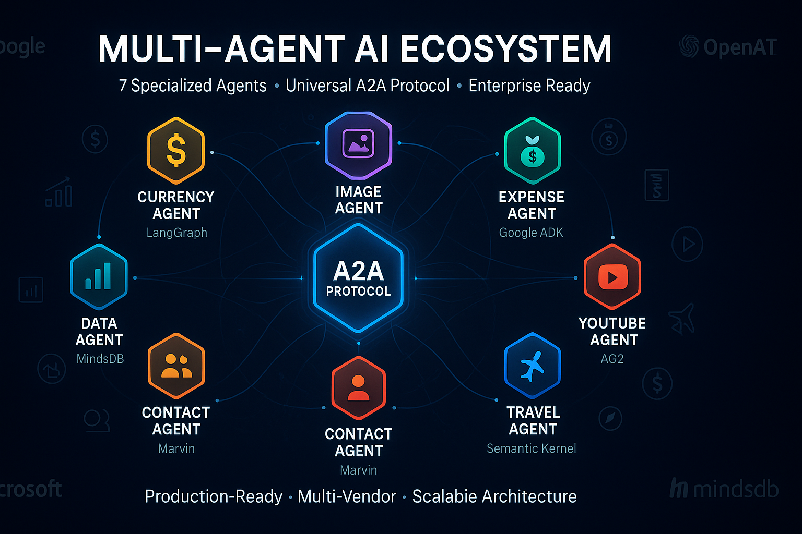

# Our Multi-Agent System
*7 Specialized Agents Working Together*

---

## System Overview

• **7 Specialized Agents** each mastering different business functions
• **One-Click Deployment** with automated setup and registration
• **Cross-Platform Integration** (Google, OpenAI, Microsoft, MindsDB)
• **Real-Time Collaboration** through A2A protocol

---

## The Agent Team

### 🌍 **Currency Agent** (LangGraph + Google)
• Real-time exchange rates and conversions
• Multi-currency calculations
• Financial compliance checks

### 🎨 **Image Generation Agent** (CrewAI + Google)
• Professional visual content creation
• Brand-consistent graphics
• Marketing materials automation

### 💰 **Expense Agent** (Google ADK)
• Automated expense processing
• Receipt analysis and categorization
• Policy compliance validation

### 📺 **YouTube Analysis Agent** (AG2 + OpenAI)
• Video content analysis
• Transcript processing
• Engagement metrics insights

### ✈️ **Travel Planning Agent** (Semantic Kernel + OpenAI)
• Complete trip planning
• Budget optimization
• Itinerary management

### 👥 **Contact Extraction Agent** (Marvin + OpenAI)
• Business card processing
• Contact data organization
• CRM integration

### 📊 **Enterprise Data Agent** (MindsDB)
• Natural language database queries
• Business intelligence insights
• Real-time analytics

---

## How They Work Together

• **Seamless Communication**: Agents share data automatically
• **Workflow Orchestration**: Complex tasks split across multiple agents
• **Error Handling**: If one agent fails, others adapt
• **Scalable Architecture**: Easy to add new agents

---


*Our complete 7-agent ecosystem working in harmony*

---

## Image Generation Prompt
```
Create a professional business diagram titled "OUR MULTI-AGENT ECOSYSTEM" in 16:9 landscape format. Use a modern color scheme with #1E3A8A blue, #10B981 green, #F59E0B amber, and #FFFFFF white.

TOP SECTION:
- Title: "OUR MULTI-AGENT ECOSYSTEM"
- Subtitle: "7 Specialized Agents • Seamless Collaboration • Enterprise Ready"

MAIN DIAGRAM:
Create a circular hub-and-spoke layout with:

CENTER HUB:
- "A2A PROTOCOL" in a large hexagon
- "Agent-to-Agent Communication"
- Connecting lines radiating to all agents

AGENT NODES (arranged in circle):
1. "CURRENCY AGENT" (🌍 icon) - "Real-time Exchange Rates"
2. "IMAGE AGENT" (🎨 icon) - "Visual Content Creation" 
3. "EXPENSE AGENT" (💰 icon) - "Automated Processing"
4. "YOUTUBE AGENT" (📺 icon) - "Video Analysis"
5. "TRAVEL AGENT" (✈️ icon) - "Trip Planning"
6. "CONTACT AGENT" (👥 icon) - "Data Extraction"
7. "DATA AGENT" (📊 icon) - "Business Intelligence"

TECHNOLOGY BADGES:
Show small tech logos near each agent:
- LangGraph, CrewAI, Google ADK, AG2, Semantic Kernel, Marvin, MindsDB
- Google, OpenAI, Microsoft logos

BOTTOM SECTION:
- "One-Click Deployment • Cross-Platform • Real-Time Collaboration"
- Performance metrics: "7 Agents • 8 Ports • 24/7 Uptime"

Use clean lines, professional icons, and ensure all text is clearly readable.
```

---

## Technical Architecture

• **Ports**: Each agent runs on dedicated port (10000-10030)
• **Health Monitoring**: Automatic status checking
• **Load Balancing**: Distribute work across available agents
• **Logging**: Complete audit trail of all interactions

---

**Next:** [Contact Agent Details →](agents/contact-agent.md)

---

## Navigation
- [← Back to Agents Overview](01-agents-overview.md)
- [Contact Agent →](agents/contact-agent.md)
- [Currency Agent →](agents/currency-agent.md)
- [Image Agent →](agents/image-agent.md)
- [Expense Agent →](agents/expense-agent.md)
- [YouTube Agent →](agents/youtube-agent.md)
- [Travel Agent →](agents/travel-agent.md)
- [Data Agent →](agents/data-agent.md) 