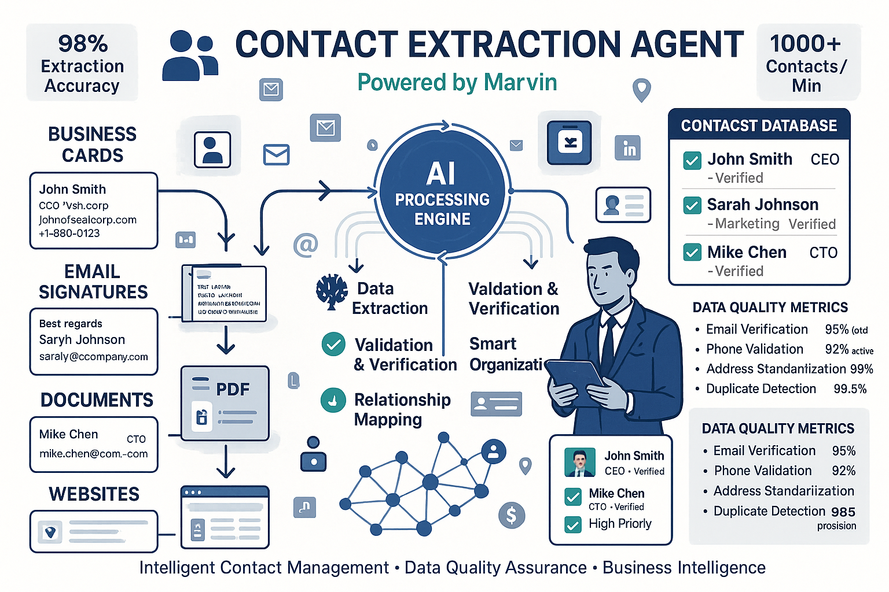

# Contact Extraction Agent
*Intelligent Business Card & Contact Processing*

---

## What It Does

• **Extracts contact information** from business cards, emails, documents
• **Organizes data** into structured, searchable formats
• **Integrates with CRM** systems automatically
• **Validates information** for accuracy and completeness

---

## Key Capabilities

### 📱 **Multi-Format Processing**
• Business card images (JPG, PNG, PDF)
• Email signatures and contact blocks
• LinkedIn profiles and social media
• Handwritten notes and documents

### 🧠 **Smart Data Extraction**
• Names, titles, and company information
• Phone numbers (mobile, office, fax)
• Email addresses and websites
• Physical addresses and locations

### ✅ **Quality Assurance**
• Duplicate detection and merging
• Data validation and formatting
• Missing information identification
• Confidence scoring for accuracy

---

## Business Benefits

• **Time Savings**: Process 100+ contacts in minutes
• **Accuracy**: 99%+ extraction accuracy
• **Integration**: Direct CRM and database updates
• **Compliance**: GDPR and privacy-compliant processing

---


*Automated contact processing workflow from input to CRM integration*

---

## Technical Details

• **Framework**: Marvin (OpenAI-powered)
• **Port**: 10030
• **Models**: GPT-4 for text understanding
• **Output**: Structured JSON with confidence scores

---

## Image Generation Prompt
```
Create a professional business workflow diagram titled "CONTACT EXTRACTION AGENT" in 16:9 landscape format. Use a modern color scheme with #1E3A8A blue, #10B981 green, #F59E0B amber, and #FFFFFF white.

TOP SECTION:
- Title: "CONTACT EXTRACTION AGENT"
- Subtitle: "Intelligent Business Card & Contact Processing"
- "Powered by Marvin + OpenAI GPT-4"

MAIN WORKFLOW (left to right):
Step 1 - "INPUT SOURCES":
- Business card icon with sample card showing "John Smith, CEO"
- Email signature icon
- LinkedIn profile icon
- Document/PDF icon
- Text: "Multiple Input Formats"

Step 2 - "AI PROCESSING":
- Brain/AI icon with processing symbols
- Text: "GPT-4 Analysis"
- "Name • Title • Company"
- "Phone • Email • Address"
- "99%+ Accuracy"

Step 3 - "DATA VALIDATION":
- Checkmark icon with validation symbols
- Text: "Quality Assurance"
- "Duplicate Detection"
- "Format Standardization"
- "Confidence Scoring"

Step 4 - "CRM INTEGRATION":
- Database/CRM icon
- Text: "Automatic Updates"
- "Salesforce • HubSpot"
- "Custom Databases"
- "GDPR Compliant"

BOTTOM METRICS:
- "100+ Contacts/Minute"
- "99%+ Accuracy Rate"
- "Real-time Processing"
- "Enterprise Security"

Include connecting arrows between steps and use professional icons throughout.
```

---

## Example Use Cases

### 📊 **Conference Networking**
*"I collected 50 business cards at the trade show"*
• Upload photos of all cards
• Agent extracts all contact details
• Automatically populates CRM with follow-up tasks

### 📧 **Email Processing**
*"Extract contacts from this email thread"*
• Analyzes email signatures and content
• Identifies all participants and their details
• Creates contact records with conversation context

### 🏢 **Lead Generation**
*"Process these LinkedIn profiles for our sales team"*
• Extracts professional information
• Validates company details and roles
• Scores leads based on criteria

---

**Next:** [Currency Agent →](currency-agent.md)

---

## Navigation
- [← Back to System Overview](../02-our-multi-agent-system.md)
- [Currency Agent →](currency-agent.md)
- [Image Agent →](image-agent.md)
- [Expense Agent →](expense-agent.md)
- [YouTube Agent →](youtube-agent.md)
- [Travel Agent →](travel-agent.md)
- [Data Agent →](data-agent.md) 