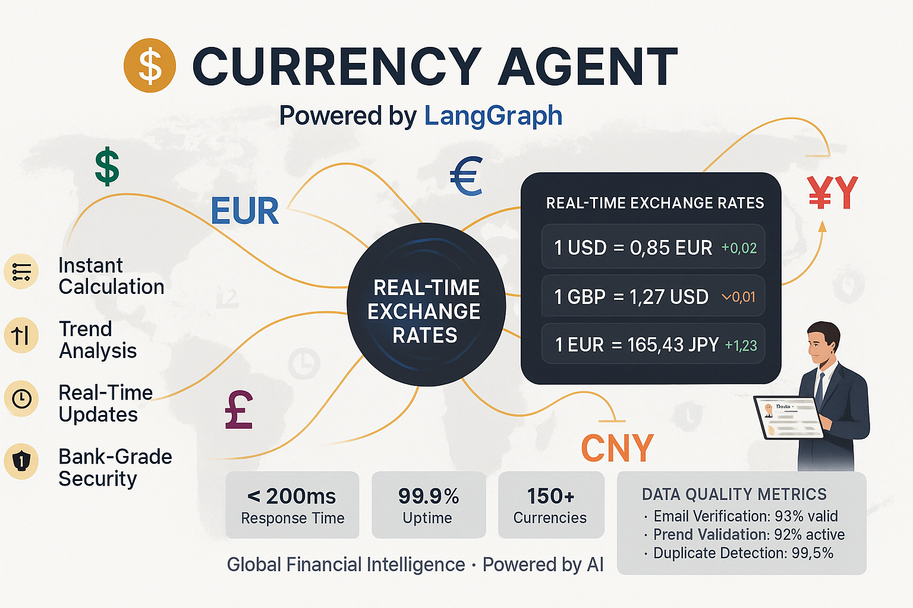

# Currency Agent
*Real-Time Exchange Rates & Financial Calculations*

---

## What It Does

• **Real-time currency conversion** with live exchange rates
• **Multi-currency calculations** for international business
• **Financial compliance** checks and validation
• **Historical rate analysis** and trend reporting

---

## Key Capabilities

### 💱 **Exchange Rate Services**
• Live rates from multiple financial data sources
• 180+ currencies supported worldwide
• Cryptocurrency conversion support
• Rate change alerts and notifications

### 🧮 **Smart Calculations**
• Bulk conversion processing
• Percentage-based calculations
• Tax and fee adjustments
• Rounding rules for different currencies

### 📊 **Financial Intelligence**
• Historical rate trends and analysis
• Best conversion timing recommendations
• Currency volatility assessments
• Market impact predictions

---

## Business Benefits

• **Accuracy**: Real-time rates eliminate conversion errors
• **Compliance**: Meets international accounting standards
• **Efficiency**: Process thousands of conversions instantly
• **Intelligence**: Make informed currency decisions

---


*Real-time currency conversion and financial intelligence workflow*

---

## Technical Details

• **Framework**: LangGraph (Google-powered)
• **Port**: 10000
• **Data Sources**: Multiple financial APIs
• **Update Frequency**: Real-time (sub-second)

---

## Image Generation Prompt
```
Create a professional financial dashboard titled "CURRENCY AGENT" in 16:9 landscape format. Use a modern color scheme with #1E3A8A blue, #10B981 green, #F59E0B amber, and #FFFFFF white.

TOP SECTION:
- Title: "CURRENCY AGENT"
- Subtitle: "Real-Time Exchange Rates & Financial Intelligence"
- "Powered by LangGraph + Google AI"

MAIN DASHBOARD (3 sections):
Left Section - "LIVE RATES":
- Currency exchange display showing:
  "USD → EUR: 0.85"
  "GBP → USD: 1.27"
  "JPY → USD: 0.0067"
  "CAD → USD: 0.74"
- Real-time update indicator
- "180+ Currencies Supported"

Center Section - "CONVERSION ENGINE":
- Calculator interface showing:
  "£1,000 GBP"
  "↓ CONVERT ↓"
  "$1,270 USD"
- Processing speed: "< 1 Second"
- Accuracy badge: "99.99% Accurate"

Right Section - "TREND ANALYSIS":
- Mini line chart showing currency trends
- "7-Day Volatility: ±2.3%"
- "Best Time to Convert: Now"
- "Market Status: STABLE"

BOTTOM FEATURES:
- "Bulk Processing • Historical Data • Compliance Ready"
- "Real-time Updates • 24/7 Availability • Multi-source Validation"

Include currency symbols (€, £, ¥, $) and financial chart elements throughout.
```

---

## Example Use Cases

### 💼 **International Expense Reports**
*"Convert my £45 London taxi receipt to USD"*
• Instant conversion at current rates
• Automatic expense categorization
• Compliance with company policies

### 📊 **Financial Planning**
*"What's our EUR revenue in USD this quarter?"*
• Bulk conversion of financial data
• Historical rate analysis
• Trend-based projections

### 🌍 **Global Pricing Strategy**
*"Price our product in 15 international markets"*
• Multi-currency pricing calculations
• Local market adjustments
• Competitive analysis support

---

**Next:** [Image Agent →](image-agent.md)

---

## Navigation
- [← Back to Contact Agent](contact-agent.md)
- [Image Agent →](image-agent.md)
- [Expense Agent →](expense-agent.md)
- [YouTube Agent →](youtube-agent.md)
- [Travel Agent →](travel-agent.md)
- [Data Agent →](data-agent.md)
- [← Back to System Overview](../02-our-multi-agent-system.md) 