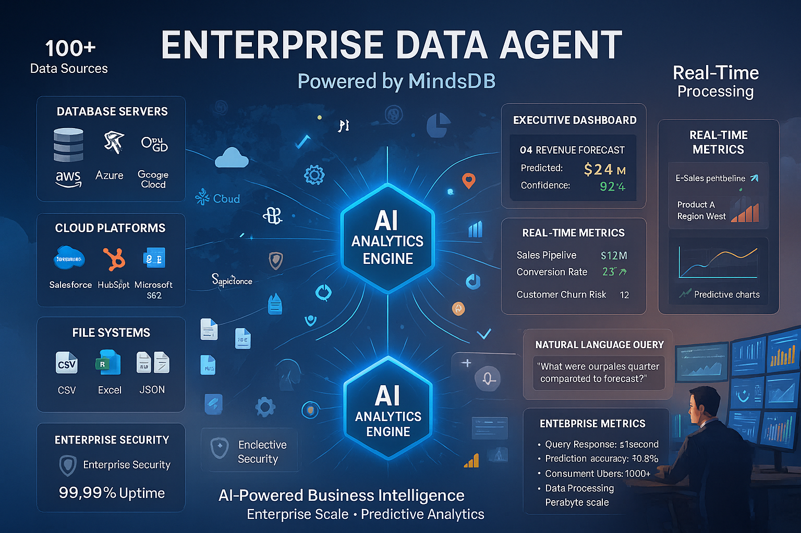

# 📊 Enterprise Data Agent (MindsDB)

## Overview
The Enterprise Data Agent is your intelligent business intelligence powerhouse, powered by MindsDB's advanced AI platform. It transforms complex enterprise data into actionable insights through natural language queries, making data analytics accessible to everyone in your organization.

## What It Does

### 🗄️ Universal Data Access
- **Multi-source Integration**: Connect to databases, APIs, files, and cloud services
- **Natural Language Queries**: Ask questions in plain English, get instant answers
- **Real-time Analytics**: Live data processing and instant insights
- **Automated Reporting**: Generate reports and dashboards automatically

### 🧠 AI-Powered Intelligence
- **Predictive Analytics**: Forecast trends and business outcomes
- **Anomaly Detection**: Identify unusual patterns and potential issues
- **Pattern Recognition**: Discover hidden insights in your data
- **Automated Insights**: Proactive recommendations and alerts

### 📈 Business Intelligence
- **Executive Dashboards**: Real-time KPI monitoring and visualization
- **Performance Analytics**: Track metrics across all business functions
- **Competitive Intelligence**: Market analysis and benchmarking
- **Financial Modeling**: Revenue forecasting and budget analysis

## Technical Implementation

### 🏗️ Architecture
- **Platform**: MindsDB for AI-powered data processing
- **AI Models**: Multiple specialized models for different data types
- **Data Sources**: 100+ integrations with enterprise systems
- **Protocol**: A2A-compliant for seamless integration

### 🔧 Key Features
- **Natural Language Interface**: "What were our sales last quarter?"
- **Auto-ML Capabilities**: Automatic model training and optimization
- **Real-time Processing**: Instant query results and live updates
- **Scalable Architecture**: Handle enterprise-scale data volumes

## Business Use Cases

### 📊 Sales Analytics
**Scenario**: Understanding sales performance and trends
- **Input**: "Show me sales trends by region for the last 6 months"
- **Process**: Queries sales database, analyzes patterns
- **Output**: Interactive dashboard with insights and forecasts

### 💰 Financial Intelligence
**Scenario**: Budget planning and financial analysis
- **Input**: "Predict our revenue for next quarter"
- **Process**: Analyzes historical data, market conditions
- **Output**: Revenue forecast with confidence intervals

### 👥 Customer Analytics
**Scenario**: Understanding customer behavior and churn
- **Input**: "Which customers are at risk of churning?"
- **Process**: Analyzes usage patterns, engagement metrics
- **Output**: Risk-scored customer list with retention strategies

## Integration Examples

### 🤝 Multi-Agent Workflows
**With Currency Agent**: Multi-currency financial reporting
**With Expense Agent**: Comprehensive expense analytics
**With Contact Agent**: Customer relationship analytics

### 📱 API Capabilities
```json
{
  "method": "query_data",
  "params": {
    "query": "SELECT sales_trend FROM revenue WHERE region='North America'",
    "natural_language": "Show sales trends in North America",
    "visualization": "chart"
  }
}
```

## Data Processing Capabilities

### 🔗 Data Sources
- **Databases**: SQL Server, PostgreSQL, MySQL, Oracle, MongoDB
- **Cloud Platforms**: AWS, Azure, Google Cloud, Snowflake
- **Business Applications**: Salesforce, HubSpot, Slack, Microsoft 365
- **File Formats**: CSV, Excel, JSON, Parquet, and more

### 🤖 AI Models
- **Time Series Forecasting**: Predict future trends and values
- **Classification**: Categorize and segment data automatically
- **Regression Analysis**: Understand relationships between variables
- **Clustering**: Identify natural groupings in your data

## Analytics Features

### 📈 Predictive Analytics
- **Sales Forecasting**: Predict future revenue and growth
- **Demand Planning**: Forecast inventory and resource needs
- **Risk Assessment**: Identify potential business risks
- **Customer Lifetime Value**: Predict long-term customer value

### 🔍 Descriptive Analytics
- **Performance Dashboards**: Real-time business metrics
- **Trend Analysis**: Historical pattern identification
- **Comparative Analysis**: Benchmark against competitors
- **Drill-down Capabilities**: Explore data at any level of detail

## Security & Compliance

### 🛡️ Enterprise Security
- **Data Encryption**: End-to-end encryption for all data
- **Access Controls**: Role-based permissions and authentication
- **Audit Trails**: Complete logging of all data access
- **Compliance**: SOC 2, GDPR, HIPAA compliance

### 🔒 Data Governance
- **Data Lineage**: Track data sources and transformations
- **Quality Monitoring**: Automatic data quality checks
- **Privacy Protection**: Anonymization and pseudonymization
- **Retention Policies**: Automated data lifecycle management

## Performance Metrics

### ⚡ Query Performance
- **Simple Queries**: < 1 second response time
- **Complex Analytics**: 5-30 seconds for advanced analysis
- **Real-time Streaming**: Sub-second latency for live data
- **Concurrent Users**: Support for 1000+ simultaneous users

### 🎯 Accuracy & Reliability
- **Prediction Accuracy**: 85-95% for most forecasting models
- **Data Quality**: 99.9% accuracy in data processing
- **System Uptime**: 99.99% availability SLA
- **Model Performance**: Continuous monitoring and optimization

## Business Impact

### 💰 ROI & Value
- **Decision Speed**: 10x faster data-driven decisions
- **Cost Reduction**: 60% reduction in analytics costs
- **Revenue Growth**: 15-25% increase through better insights
- **Operational Efficiency**: 40% improvement in data workflows

---

## Enterprise Analytics Platform



*Sophisticated enterprise data analytics platform showing AI-powered business intelligence, predictive analytics, and real-time insights from multiple data sources with natural language querying capabilities.*

---

## Image Generation Prompt

**Prompt for Infographic:**
```
Create a sophisticated enterprise data analytics infographic with a professional gradient background transitioning from deep blue (#1e3a8a) at the top to silver (#64748b) at the bottom. Image should be landscape orientation (16:9) for C-level executive presentations.

TITLE: At the top, render "📊 ENTERPRISE DATA AGENT" in large, bold white text with subtle glow effect. Below it, add "Powered by MindsDB" in smaller white text with blue accent.

CENTRAL DATA HUB: In the center, create a large, glowing hexagonal hub labeled "AI ANALYTICS ENGINE" with pulsing data streams radiating outward.

DATA SOURCES (Left Side): Show multiple input sources with flowing data streams:
1. DATABASE SERVERS: Stack of server icons with labels:
   "SQL Server, PostgreSQL, Oracle, MongoDB"

2. CLOUD PLATFORMS: Cloud icons showing:
   "AWS, Azure, Google Cloud, Snowflake"

3. BUSINESS APPLICATIONS: App icons displaying:
   "Salesforce, HubSpot, Microsoft 365"

4. FILE SYSTEMS: Document icons showing:
   "CSV, Excel, JSON, Parquet"

AI PROCESSING (Center): Around the central hub, show these AI capabilities:
- 🤖 "Auto-ML Models"
- 📈 "Predictive Analytics"
- 🔍 "Anomaly Detection"
- 🧠 "Pattern Recognition"

ANALYTICS OUTPUTS (Right Side): Display various visualization outputs:
1. EXECUTIVE DASHBOARD showing:
   "Q4 REVENUE FORECAST
   Predicted: $2.4M (+15%)
   Confidence: 92%
   Key Drivers: Product A, Region West"

2. REAL-TIME METRICS:
   "Sales Pipeline: $1.2M
   Conversion Rate: 23% ↗
   Customer Churn Risk: 12 accounts"

3. PREDICTIVE CHARTS: Line graphs showing upward trends

BUSINESS ANALYST: In the bottom right, show a modern executive at a high-tech workstation with multiple curved monitors displaying:
- Real-time dashboards
- Predictive models
- Performance metrics
- Market analysis charts

FLOATING ELEMENTS: Around the composition, add these enterprise icons:
- 💾 Database cylinders
- 🧠 AI brain symbols
- 📊 Chart/graph icons
- 🛡️ Security shields
- 💡 Insight lightbulbs
- ⚡ Real-time indicators
- 🎯 Prediction arrows

NATURAL LANGUAGE INTERFACE: Show a query box with example:
"NATURAL LANGUAGE QUERY:
'What were our sales last quarter compared to forecast?'
→ Instant AI-powered insights"

ENTERPRISE FEATURES: In the corners, add these capability badges:
- "100+ Data Sources" (top left)
- "Real-Time Processing" (top right)
- "Enterprise Security" (bottom left)
- "99.99% Uptime SLA" (bottom right)

PERFORMANCE METRICS: Display these enterprise indicators:
"ENTERPRISE METRICS:
• Query Response: <1 second
• Prediction Accuracy: 85-95%
• Concurrent Users: 1000+
• Data Processing: Petabyte scale"

BOTTOM TAGLINE: Include "AI-Powered Business Intelligence • Enterprise Scale • Predictive Analytics" in white text.

Typography: Use modern, executive-level fonts (similar to Inter or Roboto). Ensure all text is clearly readable against the gradient background. Color scheme: Deep blue and silver gradient, white text, with bright accent colors for data visualizations (green for positive metrics, blue for neutral, orange for alerts). Maintain a powerful, enterprise-ready appearance suitable for board-level presentations.
``` 