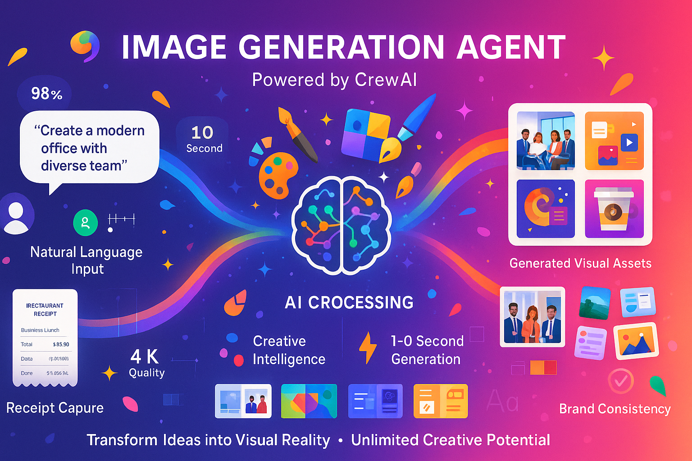

# Image Generation Agent
*Professional Visual Content Creation*

---

## What It Does

• **Creates professional images** from text descriptions
• **Generates marketing materials** with brand consistency
• **Produces infographics** and business visualizations
• **Automates visual content** for presentations and reports

---

## Key Capabilities

### 🎨 **Creative Generation**
• High-quality business graphics and illustrations
• Marketing materials (banners, social media, ads)
• Professional presentations and infographics
• Custom logos and brand elements

### 📊 **Data Visualization**
• Charts, graphs, and business dashboards
• Process diagrams and flowcharts
• Organizational charts and timelines
• Financial reports with visual elements

### 🎯 **Brand Consistency**
• Style guides and brand compliance
• Color palette management
• Typography and layout standards
• Template-based generation

---

## Business Benefits

• **Speed**: Generate visuals in seconds, not hours
• **Cost**: Eliminate expensive design agency fees
• **Consistency**: Maintain brand standards automatically
• **Scale**: Create unlimited variations and formats

---


*AI-powered visual content creation workflow from concept to delivery*

---

## Technical Details

• **Framework**: CrewAI (Google-powered)
• **Port**: 10001
• **Models**: Imagen 3 for image generation
• **Output**: High-resolution PNG/JPG formats

---

## Image Generation Prompt
```
Create a professional creative workflow diagram titled "IMAGE GENERATION AGENT" in 16:9 landscape format. Use a modern color scheme with #1E3A8A blue, #10B981 green, #F59E0B amber, and #FFFFFF white.

TOP SECTION:
- Title: "IMAGE GENERATION AGENT"
- Subtitle: "Professional Visual Content Creation"
- "Powered by CrewAI + Google Imagen 3"

MAIN WORKFLOW (left to right):
Step 1 - "TEXT INPUT":
- Text bubble icon with sample text:
  "Create a professional business infographic showing quarterly sales growth"
- Keyboard/input icon
- "Natural Language Prompts"

Step 2 - "AI PROCESSING":
- Brain/AI icon with creative symbols (palette, brush, gears)
- Text: "Imagen 3 Generation"
- "Style Analysis"
- "Brand Compliance"
- "Quality Enhancement"

Step 3 - "VISUAL OUTPUT":
- Gallery of sample outputs:
  - Business chart/infographic
  - Marketing banner
  - Presentation slide
  - Social media graphic
- "High Resolution • Multiple Formats"

Step 4 - "DELIVERY":
- Download/share icons
- Text: "Instant Delivery"
- "PNG • JPG • SVG"
- "Web Ready • Print Ready"

BOTTOM FEATURES:
- "Brand Consistency • Template Library • Batch Generation"
- "Marketing Materials • Data Visualization • Custom Graphics"

Include creative elements like color palettes, design tools, and sample visuals.
```

---

## Example Use Cases

### 📈 **Business Presentations**
*"Create a slide showing our Q4 revenue growth"*
• Generates professional charts and graphs
• Applies company branding automatically
• Optimizes for presentation format

### 📱 **Social Media Content**
*"Make an Instagram post about our new product launch"*
• Creates platform-specific dimensions
• Includes engaging visual elements
• Maintains brand consistency

### 📊 **Marketing Materials**
*"Design a banner for our trade show booth"*
• Professional marketing graphics
• High-resolution print quality
• Brand-compliant design elements

---

**Next:** [Expense Agent →](expense-agent.md)

---

## Navigation
- [← Back to Currency Agent](currency-agent.md)
- [Expense Agent →](expense-agent.md)
- [YouTube Agent →](youtube-agent.md)
- [Travel Agent →](travel-agent.md)
- [Contact Agent →](contact-agent.md)
- [Data Agent →](data-agent.md)
- [← Back to System Overview](../02-our-multi-agent-system.md) 