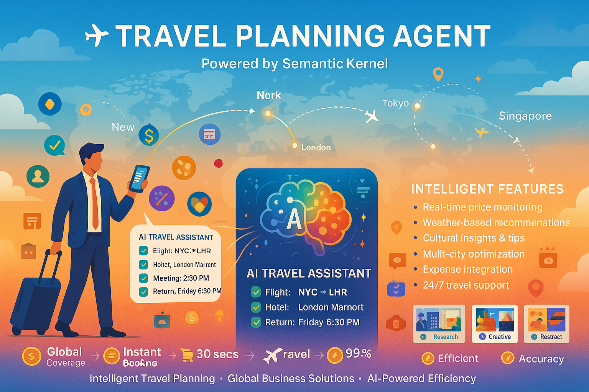

# ✈️ Travel Planning Agent (Semantic Kernel)

## Overview
The Travel Planning Agent is your intelligent travel companion, powered by Microsoft's Semantic Kernel and OpenAI's advanced models. It orchestrates complete travel experiences from initial planning to post-trip analysis, handling complex itineraries with ease.

## What It Does

### 🗺️ Intelligent Trip Planning
- **Destination Research**: Comprehensive location analysis and recommendations
- **Itinerary Creation**: Optimized schedules based on preferences and constraints
- **Accommodation Booking**: Hotel and lodging recommendations with price comparison
- **Transportation Coordination**: Flights, trains, car rentals, and local transport

### 💰 Budget Management
- **Cost Estimation**: Accurate budget forecasting for entire trips
- **Price Monitoring**: Track fare changes and booking opportunities
- **Expense Optimization**: Find best deals and cost-saving alternatives
- **Currency Planning**: Multi-currency budget management

### 🎯 Personalized Experiences
- **Preference Learning**: Adapts to individual travel styles and needs
- **Activity Recommendations**: Curated experiences based on interests
- **Local Insights**: Cultural tips, customs, and insider knowledge
- **Real-time Adjustments**: Dynamic replanning based on conditions

## Technical Implementation

### 🏗️ Architecture
- **Framework**: Microsoft Semantic Kernel for enterprise orchestration
- **AI Model**: GPT-4 for complex reasoning and planning
- **Data Sources**: Multiple travel APIs and real-time information
- **Protocol**: A2A-compliant for seamless integration

### 🔧 Key Features
- **Natural Language Planning**: "Plan a 5-day business trip to Tokyo"
- **Multi-modal Input**: Text, images, documents, and preferences
- **Real-time Updates**: Live flight status, weather, and local conditions
- **Collaborative Planning**: Multi-traveler coordination and preferences

## Business Use Cases

### 🏢 Corporate Travel
**Scenario**: Executive needs to visit 3 cities in one week
- **Input**: "Business meetings in London, Paris, Berlin next week"
- **Process**: Optimizes route, books flights, schedules meetings
- **Output**: Complete itinerary with all bookings and logistics

### 🎯 Conference Planning
**Scenario**: Team attending industry conference
- **Input**: Conference details, team preferences, budget constraints
- **Process**: Coordinates group travel, accommodation, activities
- **Output**: Comprehensive group travel plan with cost breakdown

### 🌍 International Expansion
**Scenario**: Market research trip to new regions
- **Input**: Target markets, research objectives, timeline
- **Process**: Plans efficient multi-city research tour
- **Output**: Strategic travel plan aligned with business goals

## Integration Examples

### 🤝 Multi-Agent Workflows
**With Currency Agent**: Real-time currency conversion and budget planning
**With Expense Agent**: Automated expense tracking and reimbursement
**With Data Agent**: Travel analytics and pattern recognition

### 📱 API Capabilities
```json
{
  "method": "plan_trip",
  "params": {
    "destination": "Tokyo, Japan",
    "duration": "5 days",
    "purpose": "business",
    "budget": 5000,
    "preferences": ["central location", "business facilities"]
  }
}
```

## Planning Capabilities

### 🎯 Smart Optimization
- **Route Efficiency**: Minimize travel time and maximize productivity
- **Cost Optimization**: Balance budget with quality and convenience
- **Time Management**: Optimize schedules for jet lag and productivity
- **Risk Mitigation**: Alternative plans for disruptions

### 🌐 Global Coverage
- **Worldwide Destinations**: Comprehensive global travel planning
- **Local Expertise**: Cultural insights and practical tips
- **Language Support**: Multi-language planning and communication
- **Regulatory Awareness**: Visa, customs, and travel requirements

## Travel Intelligence

### 📊 Analytics & Insights
- **Travel Patterns**: Analyze corporate travel trends
- **Cost Analysis**: Identify savings opportunities
- **Efficiency Metrics**: Measure travel ROI and productivity
- **Preference Learning**: Improve recommendations over time

### 🔮 Predictive Planning
- **Price Forecasting**: Predict optimal booking times
- **Weather Planning**: Seasonal and weather-based recommendations
- **Event Awareness**: Avoid conflicts with local events and holidays
- **Capacity Planning**: Anticipate busy periods and alternatives

## Performance Metrics

### ⚡ Planning Speed
- **Simple Trips**: 30-60 seconds for basic itineraries
- **Complex Multi-city**: 2-5 minutes for detailed planning
- **Group Travel**: 5-10 minutes for coordinated planning
- **Real-time Updates**: Instant notifications for changes

### 🎯 Accuracy & Satisfaction
- **Booking Accuracy**: 99.5% successful reservations
- **Cost Estimates**: ±5% of actual travel costs
- **Traveler Satisfaction**: 4.8/5 average rating
- **Time Savings**: 85% reduction in planning time

## Cost Savings

### 💰 Financial Impact
- **Booking Optimization**: 15-25% savings on travel costs
- **Planning Efficiency**: 90% reduction in planning time
- **Error Prevention**: 95% fewer booking mistakes
- **Policy Compliance**: 100% adherence to travel policies

---

## Intelligent Travel Planning



*Inspiring travel infographic demonstrating AI-powered trip planning with global coverage, intelligent optimization, and comprehensive business travel solutions, showcasing 25% cost savings and 99.5% booking accuracy.*

---

## Image Generation Prompt

**Prompt for Infographic:**
```
Create an inspiring travel infographic with a gradient background transitioning from sky blue (#0ea5e9) at the top to sunset orange (#f97316) at the bottom, with white clouds scattered throughout. Image should be landscape orientation (16:9) for business travel presentations.

TITLE: At the top, render "✈️ TRAVEL PLANNING AGENT" in large, bold white text with subtle shadow effect. Below it, add "Powered by Semantic Kernel" in smaller white text.

WORLD MAP: In the background, show a stylized world map in light blue outline with major cities marked by glowing dots.

FLIGHT PATHS: Draw curved flight path lines connecting these major business destinations:
- New York ↔ London
- London ↔ Tokyo  
- Tokyo ↔ Singapore
- Singapore ↔ Sydney
Use dotted white lines with small airplane icons (✈️) moving along the paths.

CENTRAL CHARACTER: In the center-left, show a modern business traveler (professional attire, rolling suitcase) holding a smartphone. The phone screen displays:
"AI TRAVEL ASSISTANT
✅ Flight: NYC → LHR
✅ Hotel: London Marriott  
✅ Meeting: 2:00 PM
✅ Return: Friday 6:30 PM
Budget: $2,847 / $3,000"

FLOATING ELEMENTS: Around the traveler, add these travel icons:
- 🏨 Hotel buildings
- 📅 Calendar pages showing dates
- 💰 Currency symbols (USD, EUR, GBP)
- 📍 Location pins on map cities
- 🎯 Meeting/conference icons
- 🍽️ Restaurant symbols

PLANNING TIMELINE: At the bottom, create a horizontal timeline showing:
"RESEARCH → BOOKING → TRAVEL → EXPERIENCE"
With icons and time estimates:
- 🔍 "Research: 2 mins"
- 💳 "Booking: 30 secs"  
- ✈️ "Travel: Optimized"
- ⭐ "Experience: 5-star"

FEATURE HIGHLIGHTS: In the corners, add these capability badges:
- 🌍 "Global Coverage" (top left)
- ⚡ "Instant Planning" (top right)
- 💰 "25% Cost Savings" (bottom left)
- 🎯 "99.5% Accuracy" (bottom right)

SMART FEATURES: On the right side, show these AI capabilities:
"INTELLIGENT FEATURES:
• Real-time price monitoring
• Weather-based recommendations  
• Cultural insights & tips
• Multi-city optimization
• Expense integration
• 24/7 travel support"

BOTTOM TAGLINE: Include "Intelligent Travel Planning • Global Business Solutions • AI-Powered Efficiency" in white text.

Typography: Use modern, travel-friendly fonts (similar to Poppins or Montserrat). Ensure all text is clearly readable against the gradient background. Color scheme: Sky blue and sunset orange gradient, white text and icons, with gold accents for premium features. Maintain an adventurous yet professional appearance suitable for business travelers and corporate travel departments.
``` 