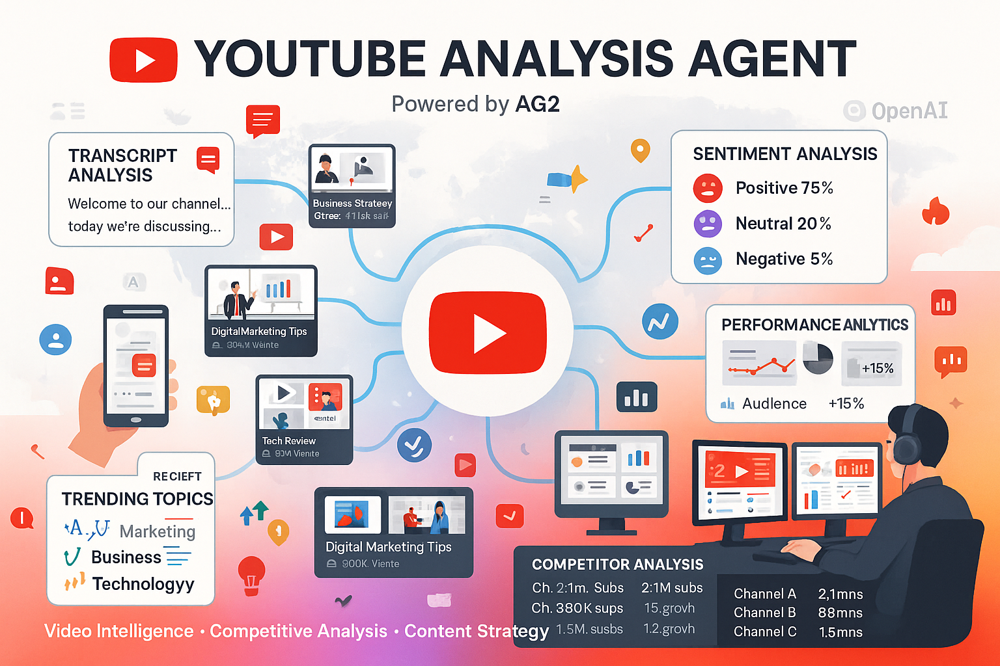

# 📺 YouTube Analysis Agent (AG2)

## Overview
The YouTube Analysis Agent is your intelligent video content analyst, powered by AG2 (AutoGen 2.0) and OpenAI's advanced models. It extracts insights, analyzes trends, and provides competitive intelligence from YouTube content at scale.

## What It Does

### 🎥 Video Content Analysis
- **Transcript Extraction**: Convert speech to searchable text
- **Content Summarization**: Key points and takeaways
- **Sentiment Analysis**: Audience reaction and engagement
- **Topic Identification**: Categorize and tag content themes

### 📊 Competitive Intelligence
- **Competitor Monitoring**: Track competitor video strategies
- **Trend Analysis**: Identify emerging topics and formats
- **Performance Metrics**: Views, engagement, growth patterns
- **Content Gaps**: Opportunities for new content

### 🎯 Strategic Insights
- **Audience Analysis**: Demographics and preferences
- **Content Optimization**: Recommendations for better performance
- **Market Research**: Industry trends and consumer behavior
- **Brand Monitoring**: Track brand mentions and sentiment

## Technical Implementation

### 🏗️ Architecture
- **Framework**: AG2 (AutoGen 2.0) for multi-agent collaboration
- **AI Model**: GPT-4 for advanced language understanding
- **Video Processing**: YouTube API integration
- **Protocol**: A2A-compliant for seamless integration

### 🔧 Key Features
- **Natural Language Queries**: "Analyze competitor videos about AI trends"
- **Batch Processing**: Analyze multiple videos simultaneously
- **Real-time Monitoring**: Track new uploads and changes
- **Custom Filters**: Focus on specific channels, topics, or timeframes

## Business Use Cases

### 🏢 Market Research
**Scenario**: Understanding industry trends
- **Input**: "Analyze top 50 videos about digital transformation"
- **Process**: Extracts themes, sentiment, key insights
- **Output**: Comprehensive market intelligence report

### 📈 Competitive Analysis
**Scenario**: Monitoring competitor content strategy
- **Input**: Competitor channel URLs
- **Process**: Analyzes content themes, posting frequency, engagement
- **Output**: Competitive intelligence dashboard

### 🎬 Content Strategy
**Scenario**: Planning video marketing campaign
- **Input**: "What video topics perform best in our industry?"
- **Process**: Analyzes successful videos, identifies patterns
- **Output**: Data-driven content recommendations

## Integration Examples

### 🤝 Multi-Agent Workflows
**With Data Agent**: Combine video insights with business metrics
**With Image Agent**: Create visuals based on video analysis
**With Contact Agent**: Identify influencers and content creators

### 📱 API Capabilities
```json
{
  "method": "analyze_video",
  "params": {
    "video_url": "https://youtube.com/watch?v=example",
    "analysis_type": ["transcript", "sentiment", "topics"],
    "language": "en"
  }
}
```

## Analysis Capabilities

### 🔍 Content Deep Dive
- **Transcript Analysis**: Full speech-to-text conversion
- **Visual Analysis**: Scene detection and object recognition
- **Audio Analysis**: Music, sound effects, voice characteristics
- **Metadata Extraction**: Title, description, tags, thumbnails

### 📊 Performance Metrics
- **Engagement Rates**: Likes, comments, shares, watch time
- **Growth Tracking**: Subscriber and view growth patterns
- **Viral Indicators**: Rapid growth and sharing patterns
- **Audience Retention**: Where viewers drop off or engage most

## Intelligence Reports

### 📈 Trend Analysis
- **Emerging Topics**: What's gaining traction
- **Content Formats**: Most effective video styles
- **Optimal Timing**: Best posting schedules
- **Audience Preferences**: What resonates with viewers

### 🎯 Actionable Insights
- **Content Recommendations**: What to create next
- **Optimization Tips**: How to improve performance
- **Competitive Gaps**: Opportunities to differentiate
- **Audience Development**: How to grow your channel

## Performance Metrics

### ⚡ Processing Speed
- **Single Video**: 30-60 seconds for full analysis
- **Batch Processing**: 10-20 videos simultaneously
- **Real-time Monitoring**: Updates every 15 minutes
- **Historical Analysis**: Process years of content quickly

### 🎯 Accuracy & Coverage
- **Transcript Accuracy**: 95%+ for clear audio
- **Language Support**: 50+ languages supported
- **Content Coverage**: All public YouTube content
- **Update Frequency**: Real-time data synchronization

---

## Video Intelligence Analytics



*Dynamic data-driven infographic showcasing YouTube video analysis capabilities including transcript extraction, sentiment analysis, trending topics, and competitive intelligence for marketing professionals and content strategists.*

---

## Image Generation Prompt

**Prompt for Infographic:**
```
Create a dynamic, data-driven infographic with YouTube's signature red (#ff0000) as the primary color, complemented by white background and dark gray accents (#374151). Image should be landscape orientation (16:9) for marketing presentations.

TITLE: At the top, render "📺 YOUTUBE ANALYSIS AGENT" in large, bold text. Use YouTube red (#ff0000) for the title. Below it, add "Powered by AG2" in smaller dark gray text.

CENTRAL ELEMENT: In the center, create a large YouTube play button (red triangle in white circle) with subtle glow effect.

VIDEO THUMBNAILS: Surround the play button with 6-8 floating video thumbnails showing:
- Tech review videos
- Business presentations  
- Marketing content
- Educational videos
Each thumbnail should have realistic video titles like:
"AI Trends 2025 - 2.3M views"
"Digital Marketing Tips - 890K views"
"Business Strategy Guide - 1.1M views"

DATA FLOW: Show flowing data streams (in light blue #3b82f6) connecting videos to analysis nodes. Include these specific analysis outputs:

1. TRANSCRIPT ANALYSIS (Top Left):
   - Show text extraction with sample transcript:
     "Welcome to our channel... today we're discussing..."
   - Label: "Speech-to-Text Conversion"

2. SENTIMENT ANALYSIS (Top Right):
   - Display sentiment indicators: 😊 Positive 75%, 😐 Neutral 20%, 😞 Negative 5%
   - Label: "Audience Sentiment"

3. TREND ANALYSIS (Bottom Left):
   - Show trending topics word cloud: "AI", "Marketing", "Business", "Technology"
   - Add trending arrows (↗) in green
   - Label: "Trending Topics"

4. PERFORMANCE METRICS (Bottom Right):
   - Display analytics dashboard:
     "Engagement Rate: 8.5%
     Watch Time: 4:32 avg
     Growth Rate: +15%"
   - Label: "Performance Analytics"

ANALYST CHARACTER: In the right side, show a modern data analyst wearing headphones, sitting at a workstation with multiple monitors displaying:
- YouTube analytics dashboards
- Trend graphs
- Competitor analysis charts

FLOATING ELEMENTS: Around the composition, add these icons:
- 📹 Video camera icons
- 📊 Analytics chart symbols  
- 💡 Insight lightbulbs
- 🔥 Trending fire icons
- 👁️ View count eyes
- 💬 Comment bubbles

COMPETITIVE INTELLIGENCE: In the bottom section, show a competitor analysis table:
"COMPETITOR ANALYSIS
Channel A: 2.1M subs, 15% growth
Channel B: 890K subs, 8% growth  
Channel C: 1.5M subs, 12% growth"

BOTTOM TAGLINE: Include "Video Intelligence • Competitive Analysis • Content Strategy" in smaller text.

Typography: Use modern, tech-focused fonts (similar to Roboto or Open Sans). Ensure all text is clearly readable. Color scheme: YouTube red primary, white background, blue data streams, with green/red for performance indicators. Maintain a cutting-edge, data-driven appearance suitable for marketing professionals and content strategists.
``` 